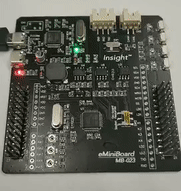
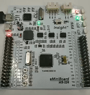

# MM32 FreeRTOS

## 目录
<!-- TOC -->

- [MM32 FreeRTOS](#mm32-freertos)
  - [目录](#%e7%9b%ae%e5%bd%95)
  - [概述](#%e6%a6%82%e8%bf%b0)
  - [效果](#%e6%95%88%e6%9e%9c)
  - [目录结构](#%e7%9b%ae%e5%bd%95%e7%bb%93%e6%9e%84)
  - [第三方代码](#%e7%ac%ac%e4%b8%89%e6%96%b9%e4%bb%a3%e7%a0%81)
  - [软件环境](#%e8%bd%af%e4%bb%b6%e7%8e%af%e5%a2%83)
    - [基本环境](#%e5%9f%ba%e6%9c%ac%e7%8e%af%e5%a2%83)
    - [推荐环境](#%e6%8e%a8%e8%8d%90%e7%8e%af%e5%a2%83)
  - [相关文档](#%e7%9b%b8%e5%85%b3%e6%96%87%e6%a1%a3)

<!-- /TOC -->

## 概述

本项目为 MindMotion 对 MM32 的 FreeRTOS 的实现使用的示例。

## 效果

任务内容：
- 任务 1: 0.5s 切换 led1
- 任务 2: 0.5s 切换 led2

Cortex M0

Cortex-M3

## 目录结构

## 第三方代码

|   名称   |  版本  |                  项目地址                  |                           许可证                           |
| :------: | :----: | :----------------------------------------: | :--------------------------------------------------------: |
| FreeRTOS | 10.2.1 |         https://www.freertos.org/          |        [MIT](https://www.freertos.org/a00114.html)         |

## 软件环境

### 基本环境

- IAR Embedded Wordbench for ARM, Verison 7.80 及以上

### 推荐环境

- IAR Embedded Wordbench for ARM, Verison 7.80 及以上

## 相关文档
